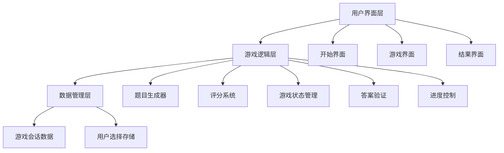

# 设计文档：99乘法表网页游戏

## 概述

99乘法表网页游戏是一个交互式的数学练习应用，旨在帮助用户通过选择题的方式练习乘法运算。系统采用现代Web技术构建，提供响应式用户界面，支持自定义游戏设置，实时反馈和详细的统计信息。

核心设计理念：
- **简洁直观**：清晰的用户界面，易于理解和操作
- **即时反馈**：实时显示得分、进度和正确率
- **教育导向**：通过视觉反馈帮助用户学习正确答案
- **响应式设计**：适配不同设备和屏幕尺寸

## 架构

### 系统架构



### 技术栈选择

- **前端框架**：原生HTML/CSS/JavaScript（考虑到项目规模和部署简便性）
- **样式方案**：CSS3 + Flexbox/Grid（响应式布局）
- **部署平台**：Netlify（静态网站托管）
- **构建工具**：无需复杂构建流程，直接部署静态文件

**设计决策理由**：
- 选择原生技术栈避免了框架复杂性，便于快速开发和部署
- Netlify提供简单的CI/CD流程，支持自动部署
- 静态网站架构确保快速加载和良好的用户体验

## 组件和接口

### 核心组件

#### 1. GameController（游戏控制器）
```javascript
class GameController {
  constructor(questionCount)
  startGame()
  nextQuestion()
  submitAnswer(selectedAnswer)
  endGame()
  resetGame()
}
```

**职责**：
- 管理游戏状态和流程
- 协调各组件间的交互
- 处理用户输入和游戏逻辑

#### 2. QuestionGenerator（题目生成器）
```javascript
class QuestionGenerator {
  generateQuestions(count)
  createMultipleChoice(correctAnswer)
  ensureUniqueness(questions)
}
```

**职责**：
- 生成1×1到9×9范围内的乘法题目
- 创建四选一的答案选项
- 确保题目不重复

#### 3. ScoreManager（评分管理器）
```javascript
class ScoreManager {
  calculateScore()
  updateAccuracy()
  getStatistics()
  resetStats()
}
```

**职责**：
- 实时计算得分和正确率
- 维护答题统计信息
- 提供结果数据

#### 4. UIRenderer（界面渲染器）
```javascript
class UIRenderer {
  renderStartScreen()
  renderGameScreen(question, options)
  renderResultScreen(stats)
  highlightCorrectAnswer(correctIndex)
  updateProgress(current, total)
}
```

**职责**：
- 渲染不同的游戏界面
- 处理视觉反馈和动画效果
- 管理响应式布局

### 接口设计

#### GameState接口
```javascript
interface GameState {
  currentQuestion: number
  totalQuestions: number
  score: number
  correctAnswers: number
  incorrectAnswers: number
  questions: Question[]
  isGameActive: boolean
}
```

#### Question接口
```javascript
interface Question {
  multiplicand: number
  multiplier: number
  correctAnswer: number
  options: number[]
  userAnswer?: number
}
```

## 数据模型

### 游戏会话数据结构

```javascript
const gameSession = {
  settings: {
    questionCount: number,    // 10, 20, 50, 100
    startTime: Date
  },
  
  progress: {
    currentIndex: number,
    completedQuestions: number,
    totalQuestions: number
  },
  
  statistics: {
    score: number,
    correctCount: number,
    incorrectCount: number,
    accuracy: number
  },
  
  questions: [
    {
      multiplicand: number,
      multiplier: number,
      correctAnswer: number,
      options: [number, number, number, number],
      userAnswer: number | null,
      isCorrect: boolean | null
    }
  ]
}
```

### 题目生成算法

**随机性保证**：
- 使用Fisher-Yates洗牌算法确保题目随机分布
- 避免同一游戏会话中出现重复题目
- 错误选项生成策略：正确答案±1-10的随机值，确保选项合理性

**选项生成逻辑**：
```javascript
function generateOptions(correctAnswer) {
  const options = [correctAnswer];
  const usedNumbers = new Set([correctAnswer]);
  
  while (options.length < 4) {
    const offset = Math.floor(Math.random() * 20) - 10; // -10到+10
    const option = Math.max(1, correctAnswer + offset);
    
    if (!usedNumbers.has(option)) {
      options.push(option);
      usedNumbers.add(option);
    }
  }
  
  return shuffleArray(options);
}
```

## 正确性属性

*属性是一个特征或行为，应该在系统的所有有效执行中保持为真——本质上是关于系统应该做什么的正式陈述。属性作为人类可读规范和机器可验证正确性保证之间的桥梁。*

### 验收标准测试预工作

1.1 当用户访问游戏页面时，THE Game_System SHALL 显示游戏开始界面
  思考：这是测试特定页面访问时应该发生的事情。我们可以通过确保页面包含特定的开始界面元素来测试这一点
  可测试性：是 - 示例

1.2 当用户点击开始游戏按钮时，THE Game_System SHALL 初始化一个新的游戏会话
  思考：这是关于所有游戏会话应该如何行为的规则，不是特定的。我们可以生成随机的游戏设置，点击开始按钮，然后验证游戏会话被正确初始化
  可测试性：是 - 属性

2.1 当用户开始游戏时，THE Game_System SHALL 提供题目数量选择选项
  思考：这是测试界面应该包含特定选项的要求
  可测试性：是 - 示例

2.3 当用户选择题目数量后，THE Game_System SHALL 根据选择生成相应数量的题目
  思考：这是关于所有题目数量选择应该如何工作的规则。我们可以测试任何有效的题目数量选择都会生成正确数量的题目
  可测试性：是 - 属性

3.2 当显示题目时，THE Game_System SHALL 提供四个答案选项，其中只有一个是正确答案
  思考：这是关于所有题目显示应该遵循的规则。我们可以生成随机题目并验证总是有四个选项且只有一个正确
  可测试性：是 - 属性

3.3 当用户选择答案时，THE Game_System SHALL 验证选择的正确性
  思考：这是关于所有答案选择应该如何处理的规则
  可测试性：是 - 属性

3.4 当答案正确时，THE Game_System SHALL 给予正面反馈并增加得分
  思考：这是关于所有正确答案应该如何处理的规则
  可测试性：是 - 属性

6.1 THE Game_System SHALL 生成1×1到9×9范围内的乘法题目
  思考：这是关于所有生成的题目都应该在指定范围内的规则
  可测试性：是 - 属性

6.3 THE Game_System SHALL 避免在同一游戏会话中重复相同的题目
  思考：这是关于题目唯一性的规则，适用于所有游戏会话
  可测试性：是 - 属性

### 属性反思

在完成初始预工作分析后，我需要审查所有标识为可测试的属性以消除冗余：

审查发现的潜在冗余：
- 属性3.3（验证答案正确性）和属性3.4（正确答案处理）可以合并为一个更全面的答案处理属性
- 其他属性提供独特的验证价值，应该保留

### 正确性属性

基于预工作分析，以下是从验收标准转换而来的可测试属性：

**属性 1：游戏会话初始化**
*对于任何*有效的游戏设置，点击开始游戏按钮应该创建一个新的游戏会话，包含正确的题目数量和初始状态
**验证：需求 1.2**

**属性 2：题目数量生成**
*对于任何*选择的有效题目数量（10、20、50、100），系统应该生成确切数量的题目
**验证：需求 2.3**

**属性 3：答案选项格式**
*对于任何*生成的题目，应该提供恰好四个答案选项，其中只有一个是正确答案
**验证：需求 3.2**

**属性 4：答案验证和得分**
*对于任何*用户答案选择，系统应该正确验证答案并相应地更新得分和统计信息
**验证：需求 3.3, 3.4**

**属性 5：题目范围约束**
*对于任何*生成的乘法题目，两个操作数都应该在1到9的范围内
**验证：需求 6.1**

**属性 6：题目唯一性**
*对于任何*游戏会话，不应该出现重复的题目（相同的乘数和被乘数组合）
**验证：需求 6.3**

## 错误处理

### 用户输入验证
- **无效题目数量选择**：默认使用10题
- **重复点击答案选项**：在反馈期间禁用交互
- **网络连接问题**：本地运行，无需网络依赖

### 系统错误处理
- **题目生成失败**：回退到预定义题目集
- **状态管理错误**：重置到初始状态
- **渲染错误**：显示友好的错误信息

### 边界情况处理
- **极端屏幕尺寸**：最小宽度320px支持
- **快速连续操作**：防抖处理避免状态混乱
- **浏览器兼容性**：支持现代浏览器（ES6+）

## 测试策略

### 双重测试方法
- **单元测试**：验证特定示例、边界情况和错误条件
- **属性测试**：验证跨所有输入的通用属性
- 两者互补且都是全面覆盖所必需的

### 单元测试重点
单元测试应专注于：
- 演示正确行为的特定示例
- 组件间的集成点
- 边界情况和错误条件

属性测试应专注于：
- 对所有输入都成立的通用属性
- 通过随机化实现全面的输入覆盖

### 属性测试配置
- 每个属性测试最少100次迭代（由于随机化）
- 每个属性测试必须引用其设计文档属性
- 标签格式：**Feature: multiplication-table-game, Property {number}: {property_text}**

### 测试框架选择
- **单元测试**：Jest（JavaScript测试框架）
- **属性测试**：fast-check（JavaScript属性测试库）
- **E2E测试**：Playwright（端到端测试）

### 测试覆盖目标
- **功能覆盖**：所有用户交互路径
- **边界测试**：最小/最大题目数量，极端答案值
- **错误场景**：无效输入，系统错误恢复
- **性能测试**：大量题目生成的响应时间

测试策略确保系统在各种条件下都能正确运行，同时通过属性测试验证核心数学逻辑的正确性。